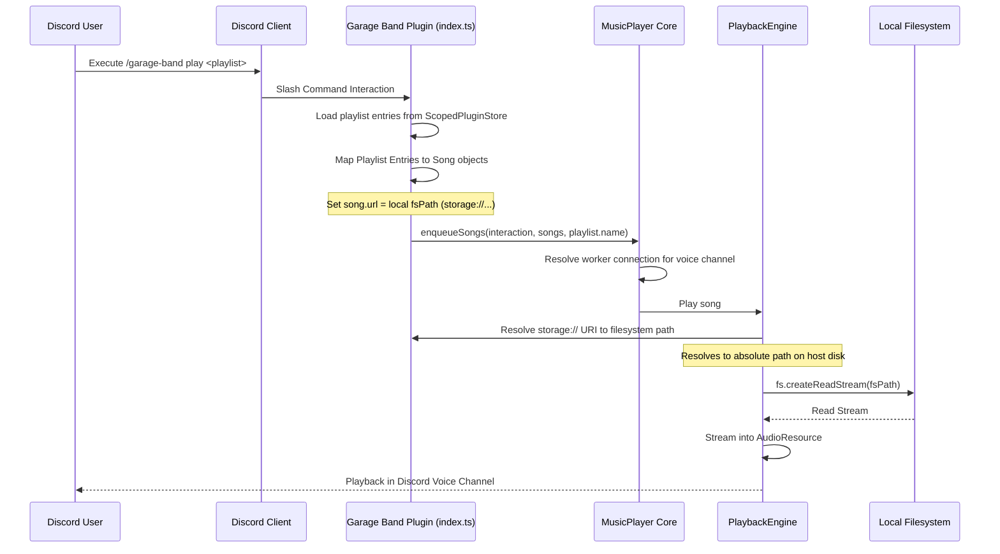

# Garage Band Plugin Status & Integration Report

This document audits the file structure, core host integration, storage model, command system, backend endpoints, and frontend dashboard components of the **Garage Band** plugin.

---

## 1. Directory File Structure

The Garage Band plugin is maintained as a git submodule pointing to the external repository.

- **Local Submodule Path**: `apps/bot/src/plugins/garage-band/`
- **Directory Layout**:

```text
apps/bot/src/plugins/garage-band/
├── jasper-plugin.json                  # Plugin Manifest defining metadata and UI routes
├── index.ts                            # Backend Entry: commands registration, API routes
├── package.json                        # Defines devDependencies and module type (type: module)
├── pnpm-lock.yaml                      # Submodule package lockfile
├── types.ts                            # Shared TypeScript interfaces for Playlists & Entries
├── README.md                           # Documentation on setup, usage, and storage architecture
└── web/                                # Frontend Directory
    ├── api.ts                          # Frontend API wrapper for REST endpoints
    ├── index.tsx                       # Frontend Entry: exports PluginPage component
    └── components/                     # Frontend UI React components
        ├── AddEntryModal.tsx           # Modal for track additions
        ├── CreatePlaylistModal.tsx     # Modal to name and initialize a new playlist
        ├── PlaylistCard.tsx            # Card layout featuring vinyl hover-rotation styling
        └── PlaylistDetail.tsx          # Track list viewer, Drop Zone, copy-play buttons
```

---

## 2. Integration with Core Host

The plugin hooks into the host application using clean interface boundaries defined by the core system.

- **Backend Module Registration**:
  `index.ts` exports a default object satisfying the `Plugin` interface:

    ```typescript
    import { Plugin, PluginContext } from '@jasper/types';

    const GarageBandPlugin: Plugin = {
        name: 'Garage Band',
        version: '1.0.0',
        onLoad: async (context: PluginContext) => {
            // Initialization: register commands, register API routes
        },
        onUnload: async (context: PluginContext) => {
            // Cleanup: clear listeners, intervals
        },
    };

    export default GarageBandPlugin;
    ```

- **Dynamic Command Registration**: Commands are registered inside `onLoad` via `context.registerCommand(command)`.
- **Dynamic Audio Playback**: When playing a playlist, `index.ts` dynamically imports the host's `music-player` to enqueue songs:
    ```typescript
    const MusicPlayerModule = await import('../../core/music-player.js');
    const MusicPlayer = MusicPlayerModule.default || MusicPlayerModule;
    return MusicPlayer.enqueueSongs(interaction, songs, playlist.name);
    ```
    The plugin maps its tracks to standard `Song` objects, specifying the resolved local file path or URL.
- **Frontend Web Component Registration**:
  `jasper-plugin.json` specifies the UI navigation link and registration components:
    ```json
    "web": {
        "entry": "web/index.tsx",
        "navItems": [
            {
                "id": "garage-band-nav",
                "label": "Garage Band",
                "icon": "music",
                "href": "/plugins/garage-band"
            }
        ],
        "pages": [
            {
                "id": "garage-band-page",
                "path": "/plugins/garage-band",
                "component": "PluginPage"
            }
        ]
    }
    ```
    The core dashboard fetches this config via `/api/plugins/registry` and imports/mounts the entry bundle dynamically.

### Garage Band Architecture & Integration

```mermaid
graph TD
    subgraph WebDashboard [Web Dashboard]
        ReactUI[React Web Components]
        DndZone[Drag & Drop Upload Zone]
        APIClient[web/api.ts Client]
    end

    subgraph FastifyServer [Fastify Server]
        WildcardRoute[/api/plugins/garage-band/*]
        StorageRoute[/api/plugins/garage-band/storage/*]
    end

    subgraph PluginBackend [Garage Band Backend Plugin]
        GBEntry[index.ts onload]
        GBRouter[DynamicPluginRouter]
    end

    subgraph DiscordPlatform [Discord Bot System]
        SlashCommand[Slash Commands /garage-band]
        BotClient[Discord.js Client]
    end

    subgraph CoreHost [Core Jasper Host]
        DB[DatabaseAdapter]
        MusicPlayer[MusicPlayer]
        PlaybackEngine[PlaybackEngine]
        StorageCore[PluginStorage Core]
    end

    subgraph PersistentStorage [Disk Storage]
        DbStorage[plugin_storage table]
        DiskData[data/plugins/garage-band/]
    end

    ReactUI --> APIClient
    DndZone --> APIClient
    APIClient --> WildcardRoute
    APIClient --> StorageRoute

    WildcardRoute --> GBRouter
    GBRouter --> GBEntry
    SlashCommand --> BotClient
    BotClient --> GBEntry

    GBEntry --> ScopedStore[ScopedPluginStore]
    GBEntry --> ScopedStorage[PluginStorage garage-band]
    GBEntry --> MusicPlayer

    ScopedStore --> DB
    ScopedStorage --> StorageCore

    DB --> DbStorage
    StorageCore --> DiskData
    MusicPlayer --> PlaybackEngine
    PlaybackEngine --> DiskData
```

---

## 3. Database & Storage Access

### Namespaced Database (`db.plugin`)

Data is stored inside the database under the namespace key `playlists` for the `garage-band` plugin, saving the entire library as a single JSON array inside `plugin_storage.value`.

- **SQLite / PostgreSQL Table**: `plugin_storage`
- **Namespace Scope**: queries are automatically limited to `plugin_name = 'garage-band'`.

### Scoped Storage Adapter (`storage`)

Audio files uploaded via the web interface or downloaded from direct URLs are placed in the host directory at `data/plugins/garage-band/`.

- **Directory Traversal Protection**: Filenames are sanitized using `path.basename(filename)`.
- **Resolution**: URIs with format `storage://garage-band/<filename>` are resolved to:
    1. `fsPath`: The absolute path on the host disk (e.g. `/home/kuasha/Dev/Jasper/apps/bot/data/plugins/garage-band/uuid.mp3`), which the host's `PlaybackEngine` streams via `fs.createReadStream`.
    2. `webUrl`: The relative HTTP endpoint `/api/plugins/garage-band/storage/<filename>` used on the React frontend.

### Local Audio File Streaming Lifecycle



---

## 4. Registered Discord Slash Commands

The plugin registers a single root command `/garage-band` with the following structure:

- `/garage-band playlist create <name>`: Initializes a new persistent playlist.
- `/garage-band playlist list`: Lists all saved playlists.
- `/garage-band playlist add <playlist> [url] [title] [attachment]`: Adds an item to the playlist.
    - **Autocomplete**: Playlist names.
    - **Mixed Sources**: Accepts a direct URL, YouTube link, or attachment upload.
- `/garage-band playlist remove <playlist> <track_id>`: Removes a track by its UUID.
- `/garage-band playlist delete <playlist>`: Deletes the playlist and its local storage files.
- `/garage-band play <playlist> [position]`: Enqueues the playlist for playback in the voice channel.
    - **Autocomplete**: Playlist names and track names/indices (for `position`).

---

## 5. Backend REST API Endpoints

All API routes are prefixed by Fastify under `/api/plugins/garage-band`:

- `GET /playlists`: Lists all playlists.
- `GET /playlists/:id`: Fetches a single playlist by ID.
- `POST /playlists`: Creates a new playlist (receives `{ name }` in JSON body).
- `POST /playlists/:id/upload`: Processes multipart audio file uploads, writes them to `PluginStorage`, runs `ffprobe` to determine duration, and appends the entry to the playlist.
- `DELETE /playlists/:id`: Deletes a playlist and unlinks all its stored local files.
- `DELETE /playlists/:id/entries/:entryId`: Removes a single track entry and unlinks its local file.

Additionally, the core host registers generic file storage endpoints under `/api/plugins/:pluginId/storage`:

- `GET /api/plugins/garage-band/storage/:filename`: Downloads/streams the stored file (sets appropriate image/audio content-type headers).
- `DELETE /api/plugins/garage-band/storage/:filename`: Deletes the file from storage.

---

## 6. Web Components & Frontend Routes

The React 18 / Vite frontend dashboard registers the following:

- **Navigation Item**: Scoped in `jasper-plugin.json` to render the "Garage Band" link with a Lucide `music` icon linking to `/plugins/garage-band`.
- **Component Page**: `PluginPage` (defined in `web/index.tsx`) is registered under path `/plugins/garage-band`.
- **Sub-components**:
    - `PlaylistCard`: Visual display card styled as a circular vinyl record that plays a rotating CSS keyframe animation on hover.
    - `PlaylistDetail`: Shows the list of tracks in a selected playlist, details (added by, duration, title, type), a copy play command button, and the **Drop Zone**.
    - `CreatePlaylistModal`: Pop-up input to create a new playlist.
    - **Drop Zone**: Area on the details panel that accepts drag-and-drop events, encodes the file as `FormData`, and posts it to the `/playlists/:id/upload` endpoint.
    - **Track Signifiers**: Dynamic Lucide icons (`youtube`, `hard-drive`, `link`) to visually show if a track is a YouTube link, local upload, or direct stream.

---

## 7. Compatibility, Verification Status & Recent Fixes

### Compatibility

- **Multi-Bot Model**: The plugin uses standard `Guild` and `Channel` identifiers to play audio via the host's Worker bots.
- **Binaries**: Relies on the `ffprobe` binary present in the server's PATH to extract durations of uploaded audio files.

### Recent Codebase Fixes

1. **ESM Load Error Fix (PR #68)**:
    - **Root Cause**: The Node.js process failed when loading the dynamic submodule plugin because TypeScript's compiler emitted CommonJS modules.
    - **Fix**: Added `"type": "module"` to `apps/bot/src/plugins/garage-band/package.json` to declare the workspace as ES Modules compliant.
2. **Vite JSX Runtime React Import Fix (PR #70)**:
    - **Root Cause**: The React client threw `ReferenceError: React is not defined` because Vite built modules using the classic JSX runtime without importing `React`.
    - **Fix**: Explicitly added `import { React } from '@jasper/elements'` in `web/index.tsx` and all React components in `web/components/`.
