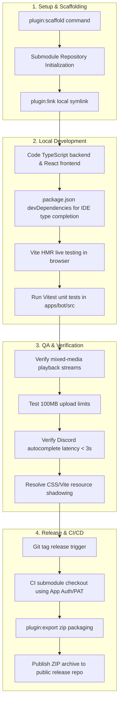

# Garage Band Phase 1 Retrospective & Lessons Learned

This document provides a retrospective analysis of the issues closed during Phase 1, outlining architectural decisions, storage schemas, and QA verification methodologies.

---

## 1. Closed Issues Review

During Phase 1, development focused on establishing a stable out-of-tree plugin model and building the base version of the **Garage Band** playlist manager.

- **Issue #40 (Epic/Feature)**: Initial epic outlining advanced playback architecture, mixed-source support, and commercialization strategies.
- **Issue #41 (Scaffold)**: Created the out-of-tree scaffolding and established local linking guidelines via `pnpm plugin:link <path>` for rapid developer prototyping.
- **Issue #42 (Backend Logic)**: Implemented namespaced database access via `ScopedPluginStore` and file storage via `PluginStorage`. Updated the host's `PlaybackEngine` (`apps/bot/src/core/audio/playback-engine.ts`) to stream files from disk bypass-routing YouTube download pipelines.
- **Issue #43 (Dashboard UI)**: Designed the Vinyl-themed dashboard page complete with a drag-and-drop file upload zone and source type visual icons.
- **Issue #44 (QA & Verification)**: Performed QA testing on playlist integrity, resolved checkout permissions inside `.github/workflows/deploy.yml` by introducing submodule PAT configurations, and fixed Vite CSS shadowing issues.
- **Issue #45 (Autocomplete)**: Added `autocomplete` handlers to the command registry and implemented dynamic option filtering for `/garage-band play` positions and playlist names.
- **Issue #61 (Automated Release Action)**: Created a CI release pipeline that triggers on repository version tags, compiling and packaging the plugin into ZIP archives and publishing them to the public release repository.

---

## 2. Out-of-Tree Scaffolding: Submodules vs Symlinks

The team established two distinct workflows for out-of-tree plugin development:

1. **Workflow A: Submodules (Team Collaboration - Recommended)**
    - The plugin is cloned inside the host codebase at `apps/bot/src/plugins/garage-band/` as a git submodule mapping to the private repository `purrfectsoft/jasper-plugin-garage-band`.
    - Submodule pointers are committed directly to the main repository, ensuring consistency across environments.
2. **Workflow B: Symlinks (Local Prototyping)**
    - External plugin folders are dynamically linked during local development using the command `pnpm --filter jasper-bot run plugin:link <path-to-external-folder>`.
    - This creates a local symbolic link at `apps/bot/src/plugins/<pluginId>`, which is ignored by git.
    - **Important Constraint**: To support Vite pre-bundling and IDE/LSP type completion inside symlinked directories, out-of-tree plugins are required to maintain a minimal `package.json` specifying `react` and `react-dom` in `devDependencies`.

---

## 3. Database Schema & Storage Serialization

### Playlist Storage Schema (`apps/bot/src/plugins/garage-band/types.ts`)

Playlists are defined using standard interfaces to represent playlists and entries:

```typescript
export interface Playlist {
    id: string; // UUID
    userId: string; // Owner Discord ID or "api"
    name: string;
    description?: string;
    createdAt: number;
    entries: PlaylistEntry[];
}

export interface PlaylistEntry {
    id: string; // UUID
    type: 'youtube' | 'direct' | 'upload';
    url?: string; // Target URL or resolved web storage URL
    storagePath?: string; // Local storage path (storage://garage-band/<filename>)
    title: string;
    duration?: number; // Calculated duration in seconds
    addedAt: number;
    addedBy?: string; // Discord user tag or "Web Upload"
}
```

### Persistence and Serialization Details

- **Database Namespace Scoping**: Playlists are stored inside the database under the namespace key `playlists` for the `garage-band` plugin, saving the entire library as a single JSON array inside `plugin_storage.value`.
- **SQLite vs PostgreSQL Tables**:
    - The SQLite table does not define indices on `plugin_name`, whereas the PostgreSQL table includes a secondary index `idx_plugin_storage_plugin_name` to optimize search performance.
    - SQLite uses a CommonJS upsert syntax:
        ```sql
        INSERT INTO plugin_storage (plugin_name, key, value, updated_at)
        VALUES (?, ?, ?, datetime('now'))
        ON CONFLICT(plugin_name, key)
        DO UPDATE SET value = excluded.value, updated_at = excluded.updated_at
        ```
    - PostgreSQL implements standard PostgreSQL upsert:
        ```sql
        INSERT INTO plugin_storage (plugin_name, key, value, updated_at)
        VALUES ($1, $2, $3, NOW())
        ON CONFLICT (plugin_name, key)
        DO UPDATE SET value = EXCLUDED.value, updated_at = NOW()
        ```
- **Storage Scopes**: Uploaded files are isolated inside `data/plugins/garage-band/`. When a playlist entry is removed or a playlist is deleted, the plugin triggers `fs.promises.unlink` on the local files to prevent orphaned storage footprints.

---

## 4. QA Verification Methodologies

The Phase 1 QA verification checklist verified the following areas:

1. **Mixed-Media Playback**: Verified that the host's `PlaybackEngine` plays YouTube tracks, direct audio URLs, and local uploads without error. For local files, verification checked that `sourceType === 'attachment'` is set and the local path is read via `fs.createReadStream`.
2. **Multipart Upload Size Limits**: Tested Fastify's multipart limit configuration to ensure uploads up to 100MB do not trigger HTTP 500 exceptions from downstream middleware.
3. **Storage Cleanup Execution**: Verified that deletion calls dynamically trigger file deletions in the folder `data/plugins/garage-band/`.
4. **Autocomplete Performance**: Checked slash command option matching to ensure autocompletion suggestions return within Discord's 3-second timeout window.
5. **Vite Resource Shadowing**: Checked that static files placed in `/public` did not shadow compiled Tailwind CSS assets, which previously caused styles to break under specific build configurations.

---

## 5. Phase 1 Development Loop


