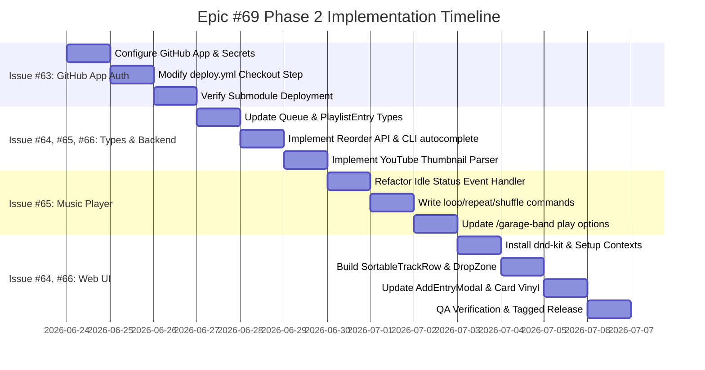

# Epic #69 Phase 2: Garage Band Enhancements & Infrastructure Roadmap

This document outlines the sequential implementation strategy, file paths, data schemas, and code integration points for executing the Phase 2 enhancements of the **Garage Band** plugin.

---

## 1. Issue Analysis and Execution Points

### Issue #63: Migrate Private Submodule Checkout to GitHub App Auth (Infra)

- **Goal**: Replace personal access tokens (`secrets.PAT_TOKEN`) with a secure, dynamically generated GitHub App installation token.
- **Target File**: `.github/workflows/deploy.yml`
- **Execution Details**:
    - Configure a GitHub App in the `Purrfectsoft` organization and grant `contents: read` permissions.
    - Add App credentials to the main repository's secrets as `DEPLOY_APP_ID` and `DEPLOY_APP_PRIVATE_KEY`.
    - Update the build job in `deploy.yml` to generate an installation token prior to checking out the codebase:

        ```yaml
        - name: Generate GitHub App Token
          id: generate-token
          uses: actions/create-github-app-token@v1
          with:
              app-id: ${{ secrets.DEPLOY_APP_ID }}
              private-key: ${{ secrets.DEPLOY_APP_PRIVATE_KEY }}

        - name: Checkout code
          uses: actions/checkout@v4
          with:
              submodules: recursive
              token: ${{ steps.generate-token.outputs.token }}
        ```

---

### Issue #64: Advanced Playlist Management & Drag-Drop Reordering (Enhancement)

- **Goal**: Support drag-and-drop track reordering in the dashboard UI and improve Discord's track removal subcommand.
- **Target Files**:
    - `apps/bot/src/plugins/garage-band/package.json`
    - `apps/bot/src/plugins/garage-band/index.ts`
    - `apps/bot/src/plugins/garage-band/web/api.ts`
    - `apps/bot/src/plugins/garage-band/web/components/PlaylistDetail.tsx`
- **Execution Details**:
    - **Dependency Updates**: Install `@dnd-kit/core`, `@dnd-kit/sortable`, and `@dnd-kit/utilities` in the plugin directory.
    - **Backend API Endpoint**: Register `PUT /playlists/:id/reorder` in `index.ts` to accept an array of entry IDs and reorder the database records:

        ```typescript
        server.put('/playlists/:id/reorder', async (req: any, reply: any) => {
            const playlistId = req.params.id;
            const { entryIds } = req.body; // Array of entry UUIDs in new order
            if (!Array.isArray(entryIds)) {
                return reply.status(400).send({ error: 'entryIds array is required' });
            }

            const playlists = await getPlaylists();
            const playlist = playlists.find((p) => p.id === playlistId);
            if (!playlist) return reply.callNotFound();

            const entryMap = new Map(playlist.entries.map((e) => [e.id, e]));
            const sortedEntries: PlaylistEntry[] = [];

            for (const id of entryIds) {
                const entry = entryMap.get(id);
                if (entry) sortedEntries.push(entry);
            }

            const remaining = playlist.entries.filter((e) => !entryIds.includes(e.id));
            playlist.entries = [...sortedEntries, ...remaining];

            await savePlaylists(playlists);
            return playlist;
        });
        ```

    - **Discord Autocomplete**: Update `index.ts` autocomplete for `/garage-band playlist remove` to filter options dynamically by track title instead of requiring raw track UUIDs:
        ```typescript
        } else if (subcommand === 'remove' && focusedOption.name === 'track_id') {
            const playlistName = interaction.options.getString('playlist') || '';
            const playlists = await getPlaylists();
            const playlist = playlists.find((p) => p.name.toLowerCase() === playlistName.toLowerCase());
            if (!playlist) {
                await interaction.respond([]);
                return;
            }
            const filtered = playlist.entries
                .filter((e) => e.title.toLowerCase().includes(focusedOption.value.toLowerCase()))
                .slice(0, 25);
            await interaction.respond(
                filtered.map((e) => ({ name: e.title, value: e.id }))
            );
        }
        ```
    - **Frontend UI**: Import `@dnd-kit` contexts inside `PlaylistDetail.tsx`. Wrap the track table in `<DndContext>` and `<SortableContext>`, extract track rows into a custom `<SortableTrackRow>` component utilizing `useSortable`, and trigger `PUT /playlists/:id/reorder` on `onDragEnd`.

---

### Issue #65: Add Loop, Shuffle, and Repeat Play Commands to Garage Band (Enhancement)

- **Goal**: Support looping the current track, repeating the whole playlist, and shuffling tracks in the queue.
- **Target Files**:
    - `packages/types/src/bot-types.ts`
    - `apps/bot/src/core/music-player.ts`
    - `apps/bot/src/plugins/garage-band/index.ts`
    - `apps/bot/src/commands/loop.ts` (New file)
    - `apps/bot/src/commands/repeat.ts` (New file)
    - `apps/bot/src/commands/shuffle.ts` (New file)
- **Execution Details**:
    - **Type Definitions**: Add `loopTrack?: boolean` and `loopQueue?: boolean` to the `Queue` interface in `bot-types.ts`.
    - **Playback Loop Engine**: Modify `AudioPlayerStatus.Idle` event listener inside `apps/bot/src/core/music-player.ts` to implement loop and repeat states:

        ```typescript
        player.on(AudioPlayerStatus.Idle, async () => {
            if (queue.stopping) return;
            if (!queue.nowPlaying) return;

            const lastSong = queue.nowPlaying;

            if (queue.loopTrack) {
                playSong(queue);
            } else {
                queue.songs.shift();

                if (queue.loopQueue && lastSong) {
                    queue.songs.push(lastSong);
                }

                if (queue.songs.length > 0) {
                    playSong(queue);
                } else if (queue.isRadio) {
                    await handleRadio(queue);
                } else if (queue.autoplay && lastSong) {
                    await handleAutoplay(queue, lastSong);
                } else {
                    // Disconnect idle sequence...
                }
            }
        });
        ```

    - **Shuffle Utility**: Add a standard Fisher-Yates shuffle helper function inside `music-player.ts` to randomize the `queue.songs` array.
    - **Commands**: Build slash commands `loop.ts`, `repeat.ts`, and `shuffle.ts` inside `apps/bot/src/commands/` to toggle flags in real-time.
    - **Playback Flags**: Add `loop`, `repeat`, and `shuffle` boolean arguments to the `/garage-band play` command in `index.ts` and pass them to the enqueuer:

        ```typescript
        const loop = interaction.options.getBoolean('loop') ?? false;
        const repeat = interaction.options.getBoolean('repeat') ?? false;
        const shuffle = interaction.options.getBoolean('shuffle') ?? false;

        return MusicPlayer.enqueueSongs(interaction, songs, playlist.name, {
            loopTrack: loop,
            loopQueue: repeat,
            shuffle,
        });
        ```

---

### Issue #66: Add Thumbnail Options to Garage Band Playlists (Enhancement)

- **Goal**: Support uploading a custom thumbnail or setting an override thumbnail URL when adding tracks.
- **Target Files**:
    - `apps/bot/src/plugins/garage-band/types.ts`
    - `apps/bot/src/plugins/garage-band/index.ts`
    - `apps/bot/src/plugins/garage-band/web/api.ts`
    - `apps/bot/src/plugins/garage-band/web/components/AddEntryModal.tsx`
    - `apps/bot/src/plugins/garage-band/web/components/PlaylistDetail.tsx`
    - `apps/bot/src/plugins/garage-band/web/components/PlaylistCard.tsx`
- **Execution Details**:
    - **Data Schema**: Add `thumbnail?: string;` property to `PlaylistEntry` in the plugin's `types.ts`.
    - **Discord Command**: Add optional `thumbnail_url` (String) and `thumbnail_file` (Attachment) arguments to `/garage-band playlist add`. Save uploaded files via `PluginStorage` and write their URLs to `entry.thumbnail`.
    - **Auto-Resolution**: Add a parser to extract default YouTube thumbnails (`https://img.youtube.com/vi/<video_id>/hqdefault.jpg`) for YouTube links if no custom override thumbnail is supplied:
        ```typescript
        const extractVideoId = (url: string): string | null => {
            const match = url.match(
                /(?:youtube\.com\/(?:[^\/]+\/.+\/|(?:v|e(?:mbed)?)\/|.*[?&]v=)|youtu\.be\/)([^"&?\/\s]{11})/i,
            );
            return match ? match[1] : null;
        };
        ```
    - **Web Dashboard**:
        - Add fields in `AddEntryModal` to provide a URL string or upload a thumbnail image.
        - Update `PlaylistDetail` to render thumbnail images alongside the track names.
        - Update `PlaylistCard` to fetch the first track's thumbnail and render it as the circular record label.

---

## 2. Sequential Implementation Timeline



### Step 1: Submodule Actions Deployment Setup (Issue #63)

- **Estimated Duration**: 1 Day
- **Tasks**:
    1. Register the Purrfectsoft GitHub App. Configure repository access to include `Jasper` and `garage-band`.
    2. Set up GitHub Secrets (`DEPLOY_APP_ID` and `DEPLOY_APP_PRIVATE_KEY`).
    3. Modify `.github/workflows/deploy.yml` to request the installation access token.
    4. Run the action to verify recursive submodule checkouts. Remove the legacy `PAT_TOKEN`.

### Step 2: Types & Basic Backend Route/Command Enhancements (Issues #64, #65, #66)

- **Estimated Duration**: 2 Days
- **Tasks**:
    1. Add `loopTrack` and `loopQueue` to the `Queue` interface inside `packages/types/src/bot-types.ts`.
    2. Add `thumbnail` to the `PlaylistEntry` interface inside `apps/bot/src/plugins/garage-band/types.ts`.
    3. Implement the `PUT /playlists/:id/reorder` endpoint inside `apps/bot/src/plugins/garage-band/index.ts`.
    4. Implement dynamic title searching inside `/garage-band playlist remove` command autocompleter.
    5. Implement YouTube thumbnail resolution inside `/garage-band playlist add` command handler.

### Step 3: Music Player Playback Controls & Commands Integration (Issue #65)

- **Estimated Duration**: 2 Days
- **Tasks**:
    1. Update `apps/bot/src/core/music-player.ts` idle event listener to handle track looping and queue repeating.
    2. Implement Fisher-Yates shuffling logic inside `music-player.ts`.
    3. Add `loop.ts`, `repeat.ts`, and `shuffle.ts` commands in `apps/bot/src/commands/`.
    4. Update `/garage-band play` command to support loop, repeat, and shuffle flags.

### Step 4: Web UI Drag-and-Drop and Modal Integration (Issues #64, #66)

- **Estimated Duration**: 3 Days
- **Tasks**:
    1. Add `@dnd-kit` dependencies to the submodule's `package.json`.
    2. Add input fields for custom track thumbnails inside `AddEntryModal.tsx`.
    3. Integrate `@dnd-kit` wrappers into `PlaylistDetail.tsx` to enable track reordering and call the backend reorder API on drag end.
    4. Display track thumbnails next to titles in the details list view, and update `PlaylistCard.tsx` to center the first song's thumbnail in the vinyl record visual.

---

## 3. Code Patterns & Best Practices

1. **Schema Integrity**: All database updates must be managed within the existing JSON-serialized plugin store key-value adapter, avoiding raw SQL table modifications.
2. **Commit Hygiene**: Group changes into logical, atomic commits targeting one issue at a time (e.g. `feat(bot): add loop/shuffle player logic` followed by `feat(web): integrate dnd-kit for playlist reordering`).
3. **Storage Cleanup**: Ensure that when removing a playlist entry or deleting a playlist, the hook unlinks the files from `data/plugins/garage-band/` to prevent orphaned files.
