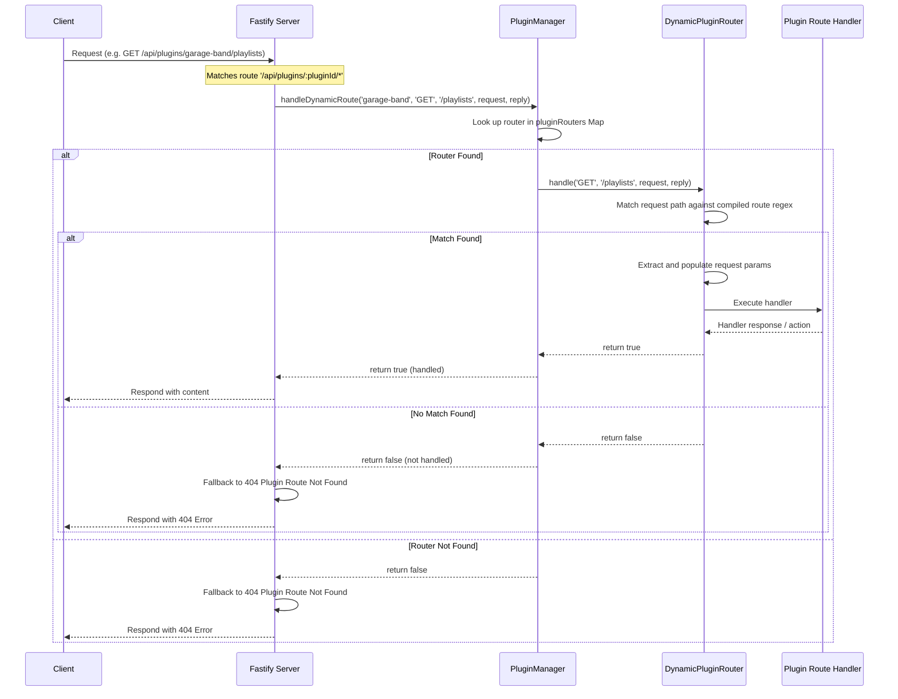
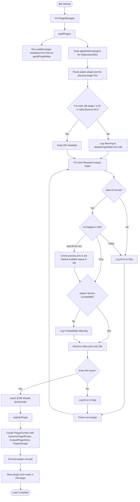

# Jasper Discord Bot: Plugin System Architecture Audit

This document details the architectural specifications, lifecycle hooks, routing mechanisms, and data persistence models of the plugin system in the Jasper Discord bot and Web Dashboard codebase.

---

## 1. DynamicPluginRouter & IPluginRouter Path Scoping

The plugin system routes HTTP API requests dynamically through the `DynamicPluginRouter` class. This class implements the `IPluginRouter` interface defined in `packages/types/src/plugin-types.ts` and allows plugins to register HTTP sub-routes dynamically under their unique namespace.

- **File Location**: `apps/bot/src/core/plugins/plugin-manager.ts`
- **Class Declaration**:

```typescript
export class DynamicPluginRouter implements IPluginRouter {
    private routes: RouteEntry[] = [];

    constructor(private pluginId: string) {}
    ...
}
```

### Path Compilation and Regex Generation

When a plugin registers a sub-route (e.g., using `get('/playlists/:id', handler)`), the path is compiled into a regular expression using the `compilePath()` method. Static segments are escaped, while parameters prefixed with `:` are matched using the `([a-zA-Z0-9_-]+)` pattern.

```typescript
private compilePath(pathStr: string) {
    const paramNames: string[] = [];
    const parts = pathStr.split(/:([a-zA-Z0-9_]+)/g);
    let regexStr = '';
    for (let i = 0; i < parts.length; i++) {
        if (i % 2 === 0) {
            regexStr += escapeRegex(parts[i]);
        } else {
            paramNames.push(parts[i]);
            regexStr += '([a-zA-Z0-9_-]+)';
        }
    }
    return { regex: new RegExp(`^${regexStr}$`), paramNames };
}
```

### Route Dispatching

When an HTTP request is routed to a plugin, `handle()` processes the path, extracts parameters if a regex match occurs, adds them to `req.params`, executes the registered handler, and returns a boolean status:

```typescript
async handle(method: string, pathStr: string, req: any, reply: any): Promise<boolean> {
    let normalizedPath = pathStr.startsWith('/') ? pathStr : `/${pathStr}`;
    if (normalizedPath.length > 1 && normalizedPath.endsWith('/')) {
        normalizedPath = normalizedPath.slice(0, -1);
    }

    for (const route of this.routes) {
        if (route.method === method || route.method === 'ALL') {
            const match = normalizedPath.match(route.regex);
            if (match) {
                req.params = req.params || {};
                route.paramNames.forEach((name, i) => {
                    req.params[name] = match[i + 1];
                });
                await route.handler(req, reply);
                return true;
            }
        }
    }
    return false;
}
```

---

## 2. Wildcard Routing Resolution in Fastify

The Fastify backend handles all dynamic plugin endpoints through a catch-all wildcard route.

- **File Location**: `apps/bot/src/api/server.ts`
- **Wildcard Route Handler**:

```typescript
server.all<{ Params: { pluginId: string; '*': string } }>(
    '/api/plugins/:pluginId/*',
    async (request, reply) => {
        const { pluginId } = request.params;
        const wildCardPath = '/' + (request.params['*'] || '');

        // Attempt dynamic plugin handling first
        const handled = await pluginManager.handleDynamicRoute(
            pluginId,
            request.method,
            wildCardPath,
            request,
            reply,
        );

        // If handled correctly by the plugin router, do not proceed
        if (handled) return;

        // If it was not handled by any dynamic route inside the plugin
        if (!reply.sent) {
            return reply.status(404).send({ error: 'Plugin Route Not Found' });
        }
    },
);
```

### HTTP Request Lifecycle Diagram



### Static API & Predefined Plugin Routes

To prevent wildcards from intercepting core operations, static/predefined plugin API route prefixes are registered directly on Fastify before the wildcard:

1. **Registry Route** (`apps/bot/src/api/plugins-registry.ts`):
    - Prefix: `/api/plugins`
    - `GET /registry`: Returns active frontend plugins (containing a `web` key in manifest).
2. **Management Routes** (`apps/bot/src/api/plugins-management.ts`):
    - Prefix: `/api/plugins`
    - `GET /`: Lists details of all installed plugins.
    - `GET /:pluginId/storage`: Returns namespaced storage filenames.
    - `GET /:pluginId/storage/:filename`: Streams a files from the plugin's storage path.
    - `POST /:pluginId/storage`: Uploads a file (requires session authentication).
    - `DELETE /:pluginId/storage/:filename`: Deletes a file from storage (requires session authentication).
    - `POST /install`: Installs a zipped plugin bundle, incorporating Zip Slip extraction validation.
3. **DevTools Routes** (`apps/bot/src/api/devtools.ts`):
    - `GET /api/devtools/plugins`: Returns real-time state of all registered plugins.
    - `POST /api/devtools/plugins/:id/toggle`: Enables/disables a plugin instantly.
    - `DELETE /api/devtools/plugins/:id`: Permanently purges a plugin folder and its data.

---

## 3. Startup Validation & Reconciliation Sequence

To prevent configuration mismatches between the database and the filesystem, a startup validation check runs when the bot launches. This resolves situations where a plugin directory was deleted manually, but the database still flags it as enabled.

- **File Location**: `apps/bot/src/core/plugins/plugin-manager.ts` inside `loadPlugins()`

### Startup Validation Sequence Diagram



---

## 4. Scoped Storage, DB Namespaces, and Database Adapters

### Scoped Plugin Storage (`PluginStorage`)

- **File Location**: `apps/bot/src/core/plugins/plugin-storage.ts`
- **Root Path**: Storage paths resolve to `data/plugins/` relative to `process.cwd()`.
- **Path Traversal Protection**: Every file read, write, or delete operation sanitizes filenames via `path.basename(filename)`.
- **URI Scheme & Resolution**: Files are addressed internally using the custom URI scheme: `storage://${pluginId}/${filename}`. The `.resolve(uri)` helper resolves these URIs to the absolute local filesystem path (`fsPath`) and relative frontend asset web URL (`webUrl`). Attempting to resolve a URI belonging to another plugin triggers a validation error.

### Scoped Database Namespaces (`ScopedPluginStore`)

- **File Location**: `apps/bot/src/core/plugins/plugin-store.ts`
- The `ScopedPluginStore` class wraps the core `DatabaseAdapter` instance. When a plugin calls `context.db.plugin.get(key)`, the store injects the plugin's unique name as the namespace, preventing plugins from accessing or modifying records belonging to other plugins.

### Database Adapters & Schemas

Jasper utilizes a unified `DatabaseAdapter` interface (`apps/bot/src/core/db/types.ts`) supporting SQLite and PostgreSQL backends.

#### SQLite Schemas (`apps/bot/src/core/db/sqlite-adapter.ts`)

```sql
CREATE TABLE IF NOT EXISTS plugin_storage (
  plugin_name TEXT NOT NULL,
  key TEXT NOT NULL,
  value TEXT,
  updated_at DATETIME DEFAULT CURRENT_TIMESTAMP,
  PRIMARY KEY (plugin_name, key)
);

CREATE TABLE IF NOT EXISTS plugin_meta (
  plugin_id TEXT PRIMARY KEY,
  enabled BOOLEAN NOT NULL DEFAULT 1,
  updated_at DATETIME DEFAULT CURRENT_TIMESTAMP
);
```

#### PostgreSQL Schemas (`apps/bot/src/core/db/postgres-adapter.ts`)

```sql
CREATE TABLE IF NOT EXISTS plugin_storage (
  plugin_name TEXT NOT NULL,
  key TEXT NOT NULL,
  value TEXT,
  updated_at TIMESTAMP WITH TIME ZONE DEFAULT CURRENT_TIMESTAMP,
  PRIMARY KEY (plugin_name, key)
);

CREATE TABLE IF NOT EXISTS plugin_meta (
  plugin_id TEXT PRIMARY KEY,
  enabled BOOLEAN NOT NULL DEFAULT TRUE,
  updated_at TIMESTAMP WITH TIME ZONE DEFAULT CURRENT_TIMESTAMP
);

CREATE INDEX IF NOT EXISTS idx_plugin_storage_plugin_name ON plugin_storage(plugin_name);
```

### Adapter Execution Comparison

| Attribute              | SQLite Adapter                                                                                      | PostgreSQL Adapter                                                                                  |
| ---------------------- | --------------------------------------------------------------------------------------------------- | --------------------------------------------------------------------------------------------------- |
| **Data Serialization** | Stringifies values to JSON string on write; parses JSON string to object on read.                   | Stringifies values to JSON string on write; parses JSON string to object on read.                   |
| **Upsert Mechanics**   | `INSERT INTO plugin_storage ... ON CONFLICT(plugin_name, key) DO UPDATE SET value = excluded.value` | `INSERT INTO plugin_storage ... ON CONFLICT(plugin_name, key) DO UPDATE SET value = EXCLUDED.value` |
| **Indexing**           | Implicit primary key index only.                                                                    | Secondary index `idx_plugin_storage_plugin_name` to optimize lookup.                                |
