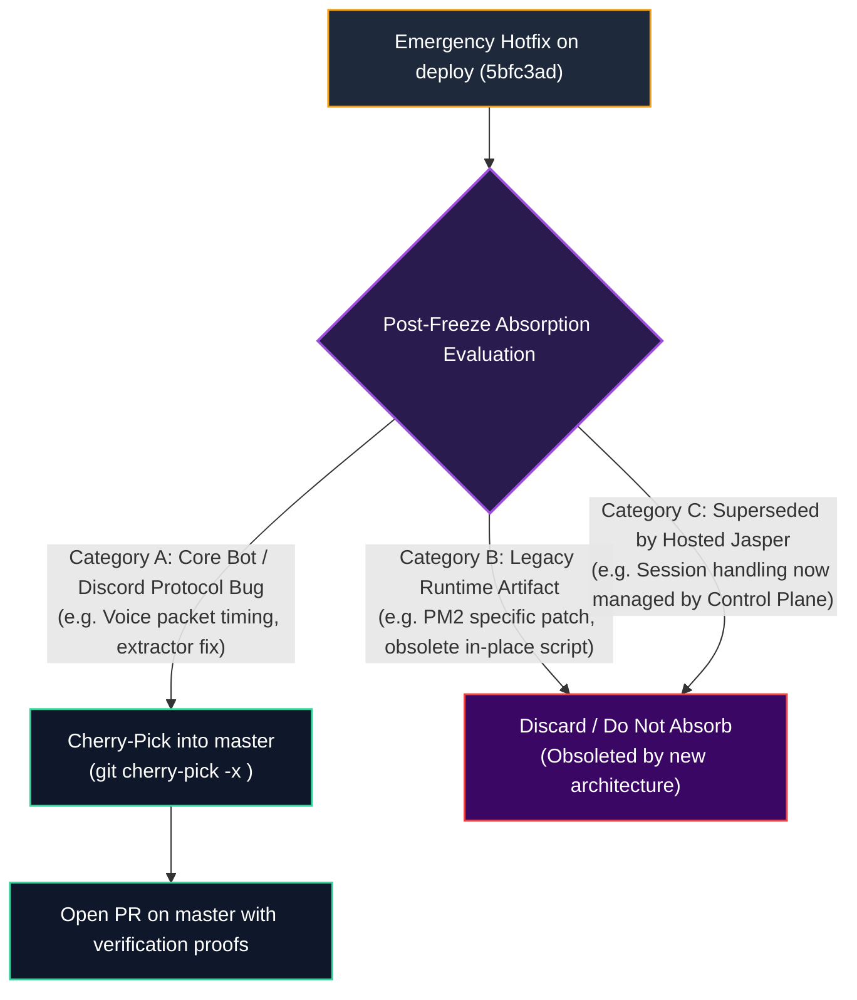

# 🔒 Live Staging Deployment Freeze & Hotfix Policy (`purrfecthq.com`)

**Status:** ACTIVE FREEZE  
**Target Lane:** `deploy` branch (pinned to commit `5bfc3ad`)  
**Live Target Host:** `purrfecthq.com` staging environment  
**Authority:** Operator Operational Directive & Engineering Governance  
**Exit Strategy:** Migration to Hosted Jasper (`purrfectsoft/jasper-hosted`) or Containerized OSS Core (HJ-OSS-19)

---

## 🎯 1. Executive Summary & Freeze Objectives

The staging deployment of Jasper serving **`purrfecthq.com`** is currently in **active live use**.

To protect live user voice sessions, prevent unverified runtime drift, and ensure zero service disruption during the ongoing development of the Hosted Jasper platform:

1. **Complete Development & Deployment Freeze**: Development and routine deployments targeting the `deploy` branch / `purrfecthq.com` live staging environment are **frozen completely**.
2. **Zero Unattended Mutation**: No automated CI promotions, speculative features, refactors, or dependency upgrades may be merged or deployed to this lane.
3. **Emergency Hotfix Path**: A strictly gated hotfix channel remains available for critical P0 operational emergencies, with explicit criteria for post-freeze absorption into `master`.
4. **Defined Real-World Migration Exit**: Once the freeze concludes, the live instance will transition either to the **Hosted Jasper platform** (`purrfectsoft/jasper-hosted`) or to the **production containerized OSS core** (`docker-compose.yml`), both of which have production-grade migration paths ready in the real world.

---

## 🛡️ 2. Staging Deployment Baseline State

| Dimension               | Baseline Value / Specification                                        |
| :---------------------- | :-------------------------------------------------------------------- |
| **Git Reference**       | `deploy` branch (`origin/deploy`)                                     |
| **Pinned Commit SHA**   | [`5bfc3ad`](https://github.com/sakibtamim/Jasper/commit/5bfc3ad)      |
| **Live Host Endpoint**  | `purrfecthq.com` staging deployment                                   |
| **Deployment Mode**     | In-place process runner (PM2 legacy host)                             |
| **Database State**      | Live staging database (preserves active user queues & guild settings) |
| **Freeze Trigger Date** | October 2, 2026                                                       |
| **Freeze Policy**       | **FAIL-CLOSED** — all changes rejected except audited P0 hotfixes     |

---

## 🚨 3. Emergency Hotfix Procedure

If a critical P0 incident impacts the live staging instance (e.g., Discord API/gateway breaking changes, unhandled crash loops, critical security vulnerabilities):

### 3.1 Hotfix Qualification Gate (P0 Only)

A change qualifies as an emergency staging hotfix **only** if:

- It addresses a complete service outage or crash loop on `purrfecthq.com`.
- It patches a critical security CVE or credential exposure.
- It fixes a Discord Gateway/Voice protocol incompatibility that prevents playback.
- **Disqualified**: UI improvements, feature enhancements, non-critical dependency bumps, or premature migrations.

### 3.2 Branching & Authoring Protocol

Hotfixes must branch directly from the **pinned staging baseline**, never from `master`:

```bash
# 1. Fetch latest state and branch from deploy baseline
git fetch origin deploy
git checkout -b hotfix/staging-<short-description> 5bfc3ad

# 2. Implement minimal, atomic fix
# Rule: Keep diff as small and targeted as possible. Zero collateral refactoring.

# 3. Verify locally
pnpm run test
pnpm run typecheck

# 4. Commit with explicit Hotfix prefix and GPG signature
git commit -S -m "hotfix(staging): <concise summary of incident mitigation>"
```

### 3.3 Operator Approval & Deployment Gate

1. Open a Pull Request targeting `deploy`:
    ```bash
    gh pr create --base deploy --title "hotfix(staging): <issue>" --body "P0 Hotfix for purrfecthq.com..."
    ```
2. The Human Operator must explicitly review and approve the diff.
3. Deploy to the live host following the emergency rollback & hotfix steps in [`deployment-freeze.md`](deployment-freeze.md).

---

## 🔄 4. Post-Freeze Absorption Evaluation Strategy

Hotfixes applied to the `deploy` lane **may or may not get absorbed back into `master`** once the freeze concludes.

Because `master` has substantially evolved (introducing the containerized architecture in HJ-OSS-18/19 and public safety policy in HJ-OSS-20), each hotfix must undergo an **Absorption Evaluation**:



### Evaluation Criteria:

1. **Absorb (Cherry-Pick to `master`)**:
    - The bug exists in shared open core logic (e.g. YouTube/yt-dlp extractor regex, Discord.js audio packet encoding, permission checks).
    - The patch is clean, vendor-neutral, and applies cleanly or cleanly rebases onto `master`.
2. **Discard (Do Not Absorb)**:
    - The patch addresses quirks of the old in-place PM2 environment (`ecosystem.config.cjs`, local path assumptions).
    - The issue has already been resolved or obsoleted by modern modules in `master` (e.g. Docker Compose non-root execution, PostgreSQL advisory locking, or runtime adapter isolation).

---

## 🏁 5. Real-World Migration Exit Strategy

The freeze will conclude upon migrating the live instance off the legacy runtime. Infrastructure is already defined and ready for two viable exit paths:

### Path 1: Hosted Jasper Platform Migration (Recommended)

- **Target Stack**: Private platform multi-cat architecture (`purrfectsoft/jasper-hosted`).
- **Capabilities**:
    - Out-of-tree `jasper-plugin-runtime-adapter` connecting bot instances to the Fastify control plane.
    - Multi-cat worker pooling (AFR) for concurrent voice channels.
    - PostgreSQL 16 Row-Level Security (RLS) tenant isolation.
    - Web management consoles (Customer Portal & Staff Console).
- **Execution**: Onboard `purrfecthq.com` as an initial tenant in the private preview cluster.

### Path 2: Modern OSS Core Containerized Migration (Interim / Fallback)

- **Target Stack**: Standardized Docker Compose stack (`docker-compose.yml` / `docker-compose.quickstart.yml`).
- **Capabilities**:
    - Immutable OCI container deployment replacing mutable in-place scripts.
    - Automated database migration and backup/restore tooling (`scripts/backup.sh`, `scripts/restore.sh`).
    - Production PostgreSQL 16 advisory locking (`POSTGRES_ADVISORY_LOCK_ID`).
    - MinIO S3-compatible asset and soundboard storage.
- **Execution**: Run database backup (`data/jasper.db`), deploy `docker-compose.yml`, and restore state idempotently.

---

## 📋 6. Operator Checklist During Freeze

- [x] Staging baseline locked to commit `5bfc3ad`.
- [x] Unattended CI deployment pipeline confirmed removed (HJ-OSS-18).
- [ ] Staging health monitored via active voice metrics and error logs.
- [ ] Any emergency incident routed exclusively through `hotfix/staging-*`.
- [ ] Post-freeze migration roadmap aligned with Hosted Jasper Wave 1/2 rollout.
